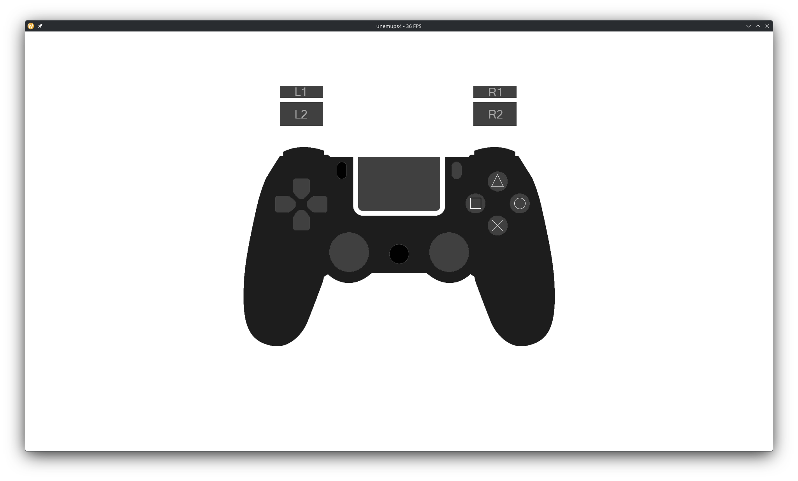

# unemups4

unemups4 is a lightweight, educational PlayStation 4 emulator written in
**Rust** (edition 2024). It runs trusted, unencrypted homebrew via high-level
emulation (HLE): the guest x86-64 code executes on an embedded JIT/interpreter
engine while the system around it — the kernel, the system libraries, the GPU —
is faked in Rust.

It is **not** a faithful or secure reimplementation of the PS4, and it does not
run commercial games. It operates **only on already-decrypted files** you
supply — a plain ELF, or a decrypted-but-still-SELF-wrapped executable (the
loader extracts the inner ELF; a still-encrypted file is rejected with a
"must be decrypted first" error). There is **no** SELF/fSELF decryption, no
keys, no SAMU emulation, no real GNM/Liverpool GPU, and no attempt at
hardening. This project provides no way to obtain or decrypt copyrighted
titles. It exists to document the Orbis
OS system architecture, to demonstrate how HLE works for an x86-64 target, and
as a platform for learning emulator development in Rust.

Licensed **GPL-3.0** (see [COPYING](COPYING)). This project contains no Sony
proprietary code, keys, firmware, or copyrighted assets.

## Screenshots

Homebrew running under the emulator:

| Software-rendered Mandelbrot | Controller input test |
|:---:|:---:|
|  |  |

## How it works

A homebrew ELF flows through four stages:

```
  homebrew.elf
      │  loader (goblin): PIE ELF map + NID→stub resolution
      ▼
  x86jit engine  ──SYSCALL trap (Exit::Syscall)──▶  HLE syscall layer
  (interp / Cranelift JIT,                          (Rust sceKernel*/scePad*/…)
   identity-mapped guest memory)                          │
      │  guest stores pixels into its own framebuffer     │
      ▼                                                    ▼
  software framebuffer  ──copy──▶  Vulkan present (full-screen quad)
```

- **Loader.** `crates/loader` uses [`goblin`](https://crates.io/crates/goblin)
  to load a plain (unencrypted) position-independent x86-64 ELF. Imported
  library functions (`sceKernel*`, `scePad*`, …) are resolved by NID to small
  generated `MOV EAX, id; SYSCALL; RET` stubs rather than to any real Sony code.
- **Execution.** Guest code runs on the **x86jit** engine (wrapped by
  `crates/cpu`), never natively on the host. The default backend is the
  Cranelift JIT with background tier-up; an interpreter is available via
  `UNEMUPS4_BACKEND=interp`. The guest arena is **identity-mapped**: a single
  `MAP_NORESERVE` span is mapped once with x86jit's `guest_base` set so a guest
  address equals its host address, which means no per-access translation and
  lets handlers dereference guest pointers directly.
- **HLE syscall layer.** The stubs' `SYSCALL` traps out of the guest as
  `Exit::Syscall`. The run loop marshals the guest registers into a Rust
  handler and writes the result back. Handlers register themselves with a
  `#[ps4_syscall]` macro plus the `inventory` crate; dispatch is a flat
  id→handler table. Because a `syscall` always traps back to the emulator, guest
  code can only reach the HLE surface — never the host kernel. Each guest thread
  is a host thread running its own `Vcpu` over a shared guest VM, with per-thread
  TLS installed into the Vcpu's `FsBase` (the host FS is untouched).
- **GPU.** Two paths. (1) *Software framebuffer:* the guest renders into its own
  memory and the host copies that into a Vulkan texture on a full-screen quad
  ([`ash`](https://crates.io/crates/ash) + [`winit`](https://crates.io/crates/winit)).
  (2) *GNM/PM4 path:* guest `sceGnm*` calls are intercepted by the `ps4-gnm` command
  processor, which decodes the PM4 stream, maintains a shadow register file (`GpuState`
  / `RegFile`), handles EOP/EOS GPU→CPU sync labels, and — for draws bound to
  firmware-embedded shaders — dispatches a hardcoded Vulkan pipeline to the display
  thread via `BackendCmd`. The `.sb` OrbShdr container parser is in place; full GCN ISA
  decode and SPIR-V recompilation are phase-4 work not yet landed. No real Liverpool GPU
  or GCN interpreter runs yet. The keyboard is mapped to a virtual DualShock via `scePad`.

## Workspace layout

Cargo workspace (`resolver = "2"`), members `app/unemups4` and `crates/*`:

```
app/unemups4/     Emulator entrypoint (boot + display loop). Crate name unemups4.
crates/core/      ps4-core     — core traits; hosts KernelInterface, DirtySource, GpuBackend
crates/cpu/       ps4-cpu      — guest execution core; wraps x86jit Vm/Vcpu; VmDirtySource
crates/memory/    ps4-memory   — UMA memory backend (VMA table over the arena)
crates/loader/    ps4-loader   — ELF loader + dynamic linker (goblin)
crates/kernel/    ps4-kernel   — HLE: process, filesystem, TLS; KernelBridge
crates/syscalls/  ps4-syscalls — syscall table (generated at build time)
crates/libs/      ps4-libs     — libkernel / system library emulation
crates/gcn/       ps4-gcn      — GCN ISA decode / recompiler (phase 4, scaffold only)
crates/gnm/       ps4-gnm      — PM4 command processor, GPU state, shader cache (Vulkan-free)
crates/gpu/       ps4-gpu      — Vulkan presentation backend (ash + winit); AshBackend
crates/macros/    ps4-macros   — proc-macro helpers (#[ps4_syscall])
examples/         Homebrew test programs; each ships a prebuilt .elf
game_data/        Guest mounts: app0/ → /app0, system/ → /system
```

More detail in [`backlog/docs/architecture.md`](backlog/docs/architecture.md).

## Status

It's a learning project that runs trusted homebrew, not a PS4 you can play games
on. Kept honest against
[`backlog/docs/status.md`](backlog/docs/status.md).

**Works:**

- Loads and runs plain (unencrypted) PIE x86-64 ELF homebrew.
- Resolves library imports (`sceKernel*`, `scePad*`, …) to Rust handlers — ~90
  of them.
- Threads, TLS, and mutex/cond/rwlock (rwlock is currently an exclusive mutex).
- Presents software-rendered output through Vulkan; keyboard mapped to a virtual
  DualShock via `scePad`.
- PM4 command processor (`ps4-gnm`): decodes the guest command stream, maintains
  a shadow register file, handles EOP/EOS sync labels, and renders draws bound to
  firmware-embedded shaders through a hardcoded Vulkan pipeline.
- `.sb` OrbShdr shader-container parser in place; GCN corpus under `crates/gcn/tests/corpus/`.
- Generates syscall id/NID/metadata tables at build time.
- Six bundled examples run (see below); `ps4-softgpu` renders correctly and hits
  the vsync cap (~60 fps) under the JIT backend.

**Not done (by design, not regressions):**

- No SELF/fSELF decryption and no `DT_SCE_*` relocation/NID tables — retail
  binaries won't load (only plain ELF via `goblin`).
- No GCN shader execution: the PM4/GNM command processor and shadow register
  file are in place, and draws bound to firmware-embedded shaders work, but
  real GCN ISA decode and SPIR-V recompilation are not yet landed (phase 4). A
  guest that issues real `.sb`-shader draw calls logs a clean deferral and shows
  nothing. This is the main gap between running demos and running games.
- Only some `R_X86_64_*` relocation types are applied; TLS offsets and multi-prx
  linking are reduced to the single-module case.
- Output is fixed at 1920x1080 RGBA8, with no swapchain recreation on resize.
- A number of higher-level calls (userService, parts of videoOut, signals) just
  return success.

## Quick start

### Build

```sh
cargo build --release
```

A [Nix](https://nixos.org/) devShell is provided (`nix develop`, or `direnv
allow` with the checked-in `.envrc`) that pins the toolchain and tools.

### Run an example

Each `examples/*` directory ships a prebuilt `.elf`, so no SDK is needed to run
them:

```sh
cargo run --release -p unemups4 -- examples/ps4-helloworld/hello_world.elf
cargo run --release -p unemups4 -- examples/ps4-softgpu/ps4-softgpu.elf
```

Bundled examples: `ps4-helloworld`, `ps4-fs`, `ps4-mmap`, `ps4-tls`,
`ps4-thread-testing`, `ps4-softgpu`. The emulator mounts `game_data/app0` as
`/app0` and `game_data/system` as `/system` for the guest.

### Environment variables

| Variable          | Effect                                                                 |
|-------------------|------------------------------------------------------------------------|
| `UNEMUPS4_BACKEND`| `jit` (default) or `interp` — pick the x86jit execution backend.       |
| `UNEMUPS4_WATCHDOG`| Enable the run-loop watchdog (guards against stuck guest execution).  |
| `UNEMUPS4_PROFILE`| `=1` (or `=<secs>`) — aggregate guest-vs-HLE profiler; zero cost unset.|
| `X86JIT_PERF_MAP` | `=1` — emit a `perf` map (`/tmp/perf-<pid>.map`) naming JIT'd blocks.  |

Full profiling workflow (`perf`, flamegraph, Tracy) and more commands live in
[`backlog/docs/commands.md`](backlog/docs/commands.md).

## Development

- Repo map and quick dev loop: [`AGENTS.md`](AGENTS.md) (and
  [`CLAUDE.md`](CLAUDE.md) for Claude-specific overrides).
- Work is tracked **locally** with [Backlog.md](https://github.com/MrLesk/Backlog.md)
  under `backlog/` — tasks, docs, and decisions, no external tracker. Browse with
  `backlog task list --plain`.

```sh
cargo test                                              # tests
cargo clippy --all-targets --all-features -- -D warnings
cargo fmt --check
```

`scripts/run_examples.sh` runs each example ELF against a committed baseline (the
migration oracle); `scripts/diff_backends.sh` runs every example under both
backends and diffs the outputs (the interpreter is the JIT's reference).

### Rebuilding the examples

The prebuilt `.elf`s let you run without any toolchain. To rebuild an example
from source you need the
[OpenOrbis PS4 Toolchain](https://github.com/OpenOrbis/OpenOrbis-PS4-Toolchain);
each example ships a `Makefile`, so `make` inside its directory rebuilds it.

The same toolchain is an **optional** build-time dependency for a larger syscall
table: `crates/syscalls/build.rs` reads symbol metadata from it. The build still
succeeds without it (smaller table + a warning). To provide it:

```sh
git clone https://github.com/OpenOrbis/OpenOrbis-PS4-Toolchain.git data/oo_sdk
```

## License and acknowledgements

Licensed **GPL-3.0**; see [COPYING](COPYING). This project ships no Sony
proprietary code, keys, firmware, or assets — it runs user-generated homebrew
only.

Built on: the **x86jit** x86-64 execution engine (interpreter + Cranelift JIT),
[`goblin`](https://crates.io/crates/goblin) (ELF loading),
[`ash`](https://crates.io/crates/ash) + [`winit`](https://crates.io/crates/winit)
(Vulkan + windowing), and the
[OpenOrbis PS4 Toolchain](https://github.com/OpenOrbis/OpenOrbis-PS4-Toolchain)
(example homebrew + syscall metadata).
