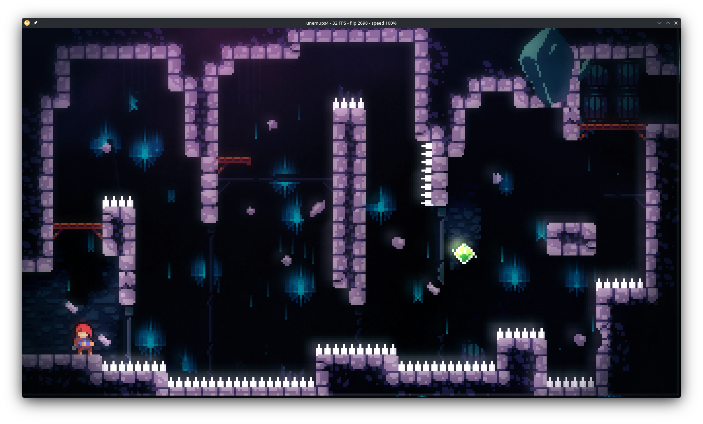
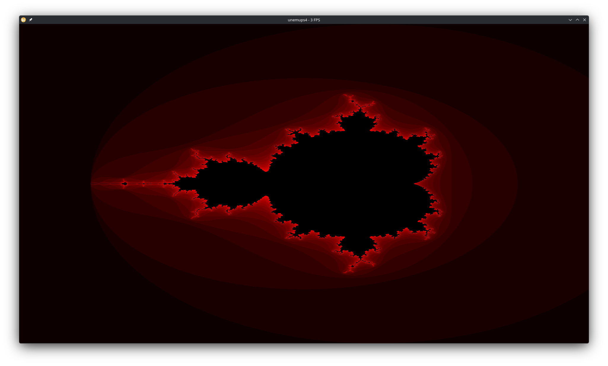

# unemups4

unemups4 is a lightweight, **educational** PlayStation 4 emulator written in
**Rust** (edition 2024). The guest x86-64 code executes on an embedded
JIT/interpreter engine while the system around it — the kernel, the system
libraries, the GPU — is faked in Rust (high-level emulation).

It is a project **for fun and for learning**. There is little point in building
the *n*-th native-execution PS4 emulator, and no ambition here to be a *fast* one:
the goal is to understand each piece and to write down how it actually works — how
the reverse-engineering was done, why each decision was made, what each wall taught.
The whole development story is in
[`backlog/docs/doc-7 - The unemups4 story`](<backlog/docs/doc-7 - The-unemups4-story-—-a-development-history.md>).

It is **not** a faithful or secure reimplementation of the PS4. It operates **only
on already-decrypted files you supply** — a plain ELF, or a decrypted (but still
SELF/OELF-wrapped) executable, from which the loader extracts the inner ELF. There
is **no** SELF/fSELF decryption, no keys, no SAMU emulation, no hardening; a still-
encrypted file is rejected with a "must be decrypted first" error. **This project
provides no way to obtain or decrypt copyrighted titles**, and ships no Sony code,
keys, firmware, or assets.

Licensed **GPL-3.0** (see [COPYING](COPYING)). This is **original work** — every
PS4/hardware fact in the tree is derived from and cited to a clean primary source
(the AMD GCN ISA, Mesa, the Linux kernel AMD headers, the OpenOrbis SDK, FreeBSD, a
real-PS4 GPU command capture) and pinned with a test; it does not copy from other
emulators. See the provenance rule in [`AGENTS.md`](AGENTS.md) and the reproducible
oracle stash under [`oracles/`](oracles/).

## Screenshots

**Celeste** (a retail title, run from an already-decrypted dump the user supplies)
booted to in-game play — real GCN shaders recompiled to SPIR-V, textures sampled
from real descriptors, physical gamepad input:



Earlier homebrew milestones:

| Software-rendered Mandelbrot | Controller input test |
|:---:|:---:|
|  |  |

## Status

A learning project, kept honest against
[`backlog/docs/status.md`](backlog/docs/status.md). What runs today:

- **Celeste** (retail, from a decrypted dump) boots to **gameplay** with physical
  gamepad input, the correct palette, and the correct textures. The main menu runs
  at ~58 fps; in-game is ~24–26 fps (peaking ~32) — CPU-bound on the interpreted
  guest code, which is the next frontier, not the GPU.
- A **PS4 Doom port** (the author's own, unpublished) is **playable with audio**.
- A second retail title (an Unreal Engine 4 game) boots through hundreds of imports
  and renders its first frames before a multi-threaded RHI deadlock (a
  cross-thread-events kernel gap, tracked in the backlog).
- The **GPU path is real**: `sceGnm*` submits are decoded as PM4, the GCN shader ISA
  is decoded and either interpreted (the correctness oracle) or **recompiled to
  SPIR-V** for Vulkan; T#/V#/S# descriptors, texture cache, tiling, and multi-texture
  binding all work. Kept portable toward MoltenVK/Metal.
- **Loader**: plain PIE ELF, and already-decrypted SELF/OELF (inner-ELF extraction,
  `DT_SCE_*` dynamic tables, NID imports, multi-`.prx` `sceKernelLoadStartModule`).
- **Kernel/libs HLE**: ~200 library entry points; threads, TLS, mutex/cond/rwlock;
  a filesystem backend; a managed-runtime bring-up (Mono/MonoGame/FMOD) for Celeste.
- Every guest thread is a host thread running its own `Vcpu` over a shared guest VM;
  syscalls trap to Rust handlers, so guest code never reaches the host kernel.

Deliberately **not** done (by design, not regressions): no SELF/fSELF decryption or
keys; general cross-thread kernel events are unimplemented (the UE4 RHI wall);
output is fixed 1920×1080; a fast JIT for the guest CPU is future work.

## How it works

A guest executable flows through the loader, the CPU engine, the HLE layer, and the
GPU path:

```
  executable (plain ELF / decrypted SELF-OELF)
      │  loader: map PIE image, extract inner ELF, resolve NID imports → SYSCALL stubs
      ▼
  x86jit engine  ──SYSCALL trap (Exit::Syscall)──▶  HLE syscall layer
  (interp / Cranelift JIT,                          (Rust sceKernel*/scePad*/sceGnm*/…)
   identity-mapped guest memory)                          │
      │  guest submits PM4 command buffers                ▼
      ▼                                     PM4 decode → GCN decode → SPIR-V recompile
  software framebuffer ──┐                              │
                         └──────────────▶  Vulkan present (ash + winit)
```

- **Loader** (`crates/loader`). Maps a plain PIE ELF via
  [`goblin`](https://crates.io/crates/goblin), or extracts the inner ELF from an
  already-decrypted SELF/OELF; parses the SCE dynamic table (`DT_SCE_*`) and resolves
  NID-hashed imports to small `MOV EAX, id; SYSCALL; RET` stubs. Multi-module `.prx`
  loading calls each `module_start` leaves-first.
- **Execution** (`crates/cpu`). Guest code runs on the **x86jit** engine, never
  natively on the host. Default backend is the Cranelift JIT with background tier-up;
  `UNEMUPS4_BACKEND=interp` selects the interpreter, which also serves as the
  correctness oracle. The guest arena is **identity-mapped** (guest address == host
  address) so handlers dereference guest pointers directly with no translation.
- **HLE syscall layer** (`crates/libs`, `crates/kernel`). The stubs' `SYSCALL` traps
  out as `Exit::Syscall`; the run loop marshals guest registers into a Rust handler
  registered by `#[ps4_syscall]`. The HLE answers as a **coherent console state** —
  e.g. the network stack reports "no link" rather than broken libraries.
- **GPU** (`crates/gnm`, `crates/gcn`, `crates/gpu`). Guest `sceGnm*` submits carry
  PM4 command buffers; `ps4-gnm` decodes them, maintains a shadow register file, and
  handles EOP/EOS GPU→CPU sync. `ps4-gcn` decodes the GCN shader ISA and interprets
  it (oracle) or recompiles it to SPIR-V. `ps4-gpu` presents through Vulkan
  ([`ash`](https://crates.io/crates/ash) + [`winit`](https://crates.io/crates/winit)),
  portable toward MoltenVK. A `dcbdump` tool (`tools/ps4-gnm-scrape/host`) prints a
  real console command capture through the same decoder — the ground-truth oracle.

## Workspace layout

Cargo workspace (`resolver = "2"`), members `app/unemups4`, `crates/*`, and tools:

```
app/unemups4/     Emulator entrypoint (boot + display loop). Crate name unemups4.
crates/core/      ps4-core     — core traits: KernelInterface, DirtySource, GpuBackend
crates/cpu/       ps4-cpu      — guest execution core; wraps the x86jit Vm/Vcpu
crates/memory/    ps4-memory   — UMA memory backend (VMA table over the arena)
crates/loader/    ps4-loader   — ELF / SELF-OELF loader + dynamic linker (goblin)
crates/kernel/    ps4-kernel   — HLE: process, filesystem, TLS; KernelBridge
crates/syscalls/  ps4-syscalls — syscall table (generated at build time)
crates/libs/      ps4-libs     — libkernel / system-library emulation (~200 entries)
crates/gcn/       ps4-gcn      — GCN ISA decoder + interpreter + SPIR-V recompiler
crates/gnm/       ps4-gnm      — PM4 command processor, GPU state, shader cache (Vulkan-free)
crates/gpu/       ps4-gpu      — Vulkan presentation backend (ash + winit)
crates/macros/    ps4-macros   — proc-macro helpers (#[ps4_syscall])
examples/         Homebrew test programs (each ships a prebuilt .elf)
tools/            PC-side tooling (real-PS4 GNM capture receiver + dcbdump decoder)
oracles/          Clean-oracle reproducer + manifest (fetched content gitignored)
```

More detail in [`backlog/docs/architecture.md`](backlog/docs/architecture.md); the
GPU bring-up story in
[`doc-6`](<backlog/docs/doc-6 - Retail-GNM-bring-up-—-discovery-log-how-the-GPU-path-was-reverse-engineered.md>).

## Quick start

```sh
cargo build --release
cargo run --release -p unemups4 -- examples/ps4-softgpu/ps4-softgpu.elf
```

A [Nix](https://nixos.org/) devShell is provided (`nix develop`, or `direnv allow`
with the checked-in `.envrc`) that pins the toolchain and tools. Each `examples/*`
directory ships a prebuilt `.elf`, so no SDK is needed to run them; the emulator
mounts `game_data/app0` as `/app0` and `game_data/system` as `/system`.

| Variable            | Effect                                                                 |
|---------------------|------------------------------------------------------------------------|
| `UNEMUPS4_BACKEND`  | `jit` (default) or `interp` — pick the x86jit execution backend.       |
| `UNEMUPS4_PROFILE`  | `=1` (or `=<secs>`) — aggregate guest-vs-HLE profiler; zero cost unset.|
| `X86JIT_PERF_MAP`   | `=1` — emit a `perf` map (`/tmp/perf-<pid>.map`) naming JIT'd blocks.  |

Full profiling workflow and more commands live in
[`backlog/docs/commands.md`](backlog/docs/commands.md).

## Development

- Repo map and dev loop: [`AGENTS.md`](AGENTS.md) (and [`CLAUDE.md`](CLAUDE.md) for
  Claude-specific overrides). Work is tracked **locally** with
  [Backlog.md](https://github.com/MrLesk/Backlog.md) under `backlog/` — browse with
  `backlog task list --plain`.

```sh
cargo test
cargo clippy --all-targets --all-features -- -D warnings
cargo fmt --check
```

The clean-oracle stash used to cite hardware facts is reproduced locally with
`./oracles/fetch-oracles.sh fetch` (see [`oracles/MANIFEST.md`](oracles/MANIFEST.md));
the in-code witness tests pin constants to those sources by value, so `cargo test`
runs without the stash present.

## License and acknowledgements

Licensed **GPL-3.0**; see [COPYING](COPYING). Ships no Sony proprietary code, keys,
firmware, or assets — it runs user-supplied homebrew and already-decrypted dumps only.

Built on: the **x86jit** x86-64 execution engine (interpreter + Cranelift JIT),
[`goblin`](https://crates.io/crates/goblin) (ELF loading),
[`ash`](https://crates.io/crates/ash) + [`winit`](https://crates.io/crates/winit)
(Vulkan + windowing), and the
[OpenOrbis PS4 Toolchain](https://github.com/OpenOrbis/OpenOrbis-PS4-Toolchain)
(example homebrew + syscall metadata). Hardware facts are cited to the AMD GCN ISA,
Mesa, the Linux kernel AMD headers, the OpenOrbis SDK/OELF spec, and FreeBSD.
